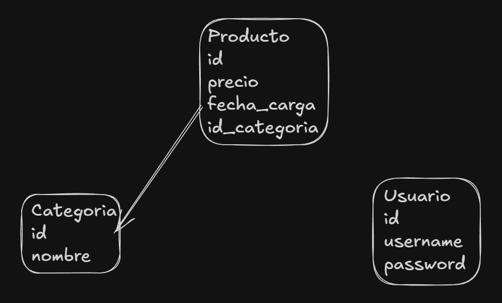
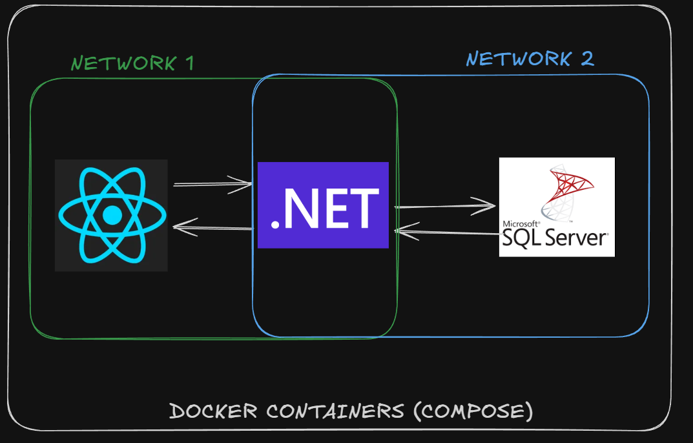

# GYF Challenge

## Índice

1. [Cómo correr el programa](#cómo-correr-el-programa)  
2. [Variables de entorno](#variables-de-entorno)  
3. [Cómo ejecutar unit tests](#cómo-ejecutar-unit-tests)  
4. [Estructura del proyecto](#estructura-del-proyecto)  
5. [Modelado de datos](#modelado-de-datos)  
6. [Arquitectura](#arquitectura)  
7. [Documentación de API](#documentacion-de-api)  
8. [Decisiones técnicas](#decisiones-técnicas)  

---

## 1. Cómo correr el programa

### Requerimientos

- Tener **Docker** instalado en la máquina.

### Pasos

Clonar el repositorio:

```bash
git clone https://github.com/Brun02K20/gyf_productos.git
```

Ingresar a la carpeta del proyecto:

```bash
cd gyf_productos
```

Levantar el entorno completo:

```bash
docker compose up -d --build
```

## 2. Variables de entorno

Si bien una buena práctica es no subir las variables de entorno al repositorio, para agilizar el envío y evaluación de esta prueba técnica se decidió incluir las variables necesarias tanto para el frontend como para el backend.

En un entorno productivo real, estas variables deberían gestionarse mediante archivos .env excluidos del control de versiones o mediante un gestor seguro de secretos.

## 3. Cómo ejecutar unit tests

Moverse a la carpeta del backend:

```bash
docker compose up -d --build
```

Ejecutar:

```bash
dotnet test backend.sln
```

## 4. Estructura del proyecto

El proyecto está organizado como un monorepo que contiene un monolito compuesto por tres partes principales:

* Frontend desarrollado en React.
* Backend desarrollado en ASP.NET.
* Base de datos SQL Server, creada a partir de una imagen Docker para facilitar su configuración y portabilidad.

El uso de Docker permite levantar todo el entorno de manera consistente en cualquier máquina.

## 5. Modelado de datos




## 6. Arquitectura 
La arquitectura simplificada puede visualizarse en la siguiente imagen:



### Descripcion

Se cuenta con un conjunto de contenedores organizados mediante dos redes Docker:

* Una red que conecta frontend ↔ backend.
* Otra red que conecta backend ↔ base de datos.

Además:

* Se utiliza un volumen Docker para la persistencia de datos.
* Esto permite conservar la información incluso si los contenedores se reinician.
* También facilita la extracción de datos desde el contenedor hacia el host si fuese necesario.

### 7. Documentación de API

Se documentó la API a través de la herramienta Swagger, para acceder a la misma primero levante el proyecto, posteriormente ingrese al navegador de su preferencia e ingrese la siguiente url: 

```bash
http://localhost:5000/swagger
```

## 8. Decisiones Técnicas

### Uso de Docker para SQL Server

Debido a dificultades para ejecutar SQL Server de manera local, se optó por utilizar una imagen oficial de Docker. Esto permitió:

* Simplificar la configuración del entorno y facilitar la subida del proyecto al repositorio.
* Garantizar que la aplicación pueda ejecutarse en cualquier entorno de manera consistente.

### Base de datos en memoria para Unit Tests

Para los unit tests se decidió utilizar una segunda base de datos en memoria mediante SQLite.
Así Los tests pueden ejecutarse en un entorno aislado sin afectar la base de datos principal.

### Uso de DTO

Se utilizó el patrón de diseño DTO (Data Transfer Object) para:

* Transferir únicamente la información mínima y necesaria entre frontend y backend.
* Mejorar seguridad y claridad en los contratos de API.

### Docker Compose

Se utilizó Docker Compose para orquestar: Frontend; Backend; Base de datos

Esto permite levantar todo el aplicativo con un solo comando, facilitando la evaluación y ejecución del challenge.